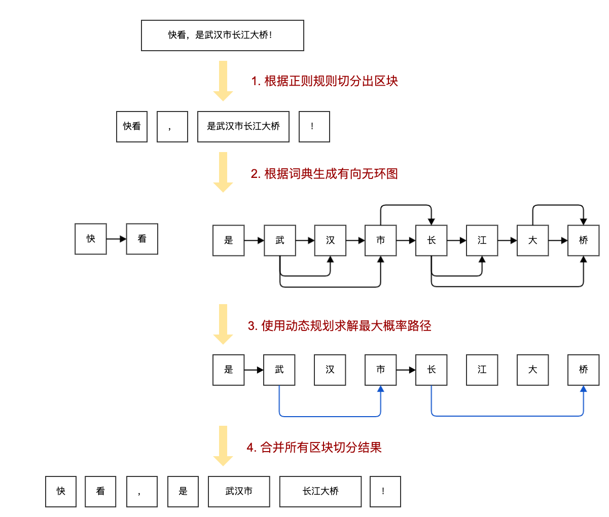

# Simple Jieba

[](https://pypi.org/project/simjb/)
[](https://github.com/Ailln/simple-jieba/blob/master/LICENSE)
[](https://github.com/Ailln/simple-jieba/stargazers)

✂️ 用 [100](simjb/token.py) 行实现简单版本的 [jieba](https://github.com/fxsjy/jieba) 分词。

> 新版本而外增加了 `add_word` 和 `del_word` 方法，用于添加和删除词频字典中的词，因此总体行数略超 100。

## 1 快速上手

### 1.1 安装

```bash
pip install simjb

# 或者
git clone https://github.com/Ailln/simple-jieba.git
cd simple-jieba && python setup.py install
```

### 1.2 分词

```python
from simjb import cut

result = cut("为中华之崛起而读书！")
# result: ['为', '中华', '之', '崛起', '而', '读书', '！']
```

### 1.3 添加词

```python
from simjb import cut, add_word

add_word("中华之")
result = cut("为中华之崛起而读书！")
# result: ['为', '中华之', '崛起', '而', '读书', '！']
```

### 1.4 删除词

```python
from simjb import cut, del_word

del_word("读书")
result = cut("为中华之崛起而读书！")
# result: ['为', '中华', '崛起', '而', '读'， '书', '！']
```

## 2 性能对比

由于该简单版本代码只实现了 jieba 分词的核心功能，可以预期的结果是：**分词正确率下降，分词速度上升。**

我使用了 [bakeoff2005](http://sighan.cs.uchicago.edu/bakeoff2005/) 的数据集中的 `Peking University` 训练集和
`Microsoft Research` 训练集进行性能对比，得到的结果如下：

> 测试设备：MacBook Pro (13-inch, M1, 2020)

| Peking University(pku) |       正确率（正确词数/所有词数）        |      速度（所有词数/花费时间）       |
|:----------------------:|:---------------------------:|:------------------------:|
|         jieba          |   78.54% (871705/1109949)   |   172k (1109949/6.44s)   |
|         simjb          | **80.58%** (894347/1109949) | **184k** (1109949/6.02s) |


| Microsoft Research(msr) |        正确率（正确词数/所有词数）        |       速度（所有词数/花费时间）       |
|:-----------------------:|:----------------------------:|:-------------------------:|
|          jieba          |   80.60% (1908851/2368422)   |   217k (2368422/10.92s)   |
|          simjb          | **81.61%** (1932899/2368422) | **218k** (2368422/10.88s) |

然鹅，这两份不同数据集的结果都有些诡异！居然在分词正确率和分词速度都有小幅度提升～

我最初从 jieba 的源码中整理出这部分的核心代码，仅仅是希望后人想要学习时，有一份简明易懂地学习资料。从上文的结果来看，这个简单版本似乎是可用的！

具体的测试方法见[这里](test/README.md)。（欢迎大家可以做更多的测试来打脸，哈哈哈）

## 3 源码解析



### 3.1 根据正则规则切分出区块

首先将输入的句子以规则进行分割，其中标点符号会被独立的切分开来，得到了一个切分区块的列表。

```python
import re


class Tokenizer(object):
    def __init__(self) -> None:
        self.normal_ptn = re.compile(r"([\u4E00-\u9FD5a-zA-Z\d+#&._%-]+)", re.U)

    def cut(self, sentence: str) -> list:
        if type(sentence) != str:
            raise TypeError("sentence must be str!")

        # 以非标点符号分割句子
        text_blocks = self.normal_ptn.split(sentence)
        cut_result = []
        for index, block in enumerate(text_blocks):
            if len(block) > 0:
                if index % 2 == 0:
                    cut_result.append(block)
                else:
                    cut_result.extend(self.__cut_util(block))
        return cut_result
```

例子：`快看，是武汉市长江大桥！` => `["快看", "，", "是武汉市长江大桥", "！"]`

下一步，我们会将文本区块 `快看` 和 `是武汉市长江大桥` 进行处理。

### 3.2 根据词典生成有向无环图

对于每一个区块，使用一个巨大的词频词典对其进行切分，构建出一个有向无环图。 词典的格式如下所示：

```
AT&T 3 nz
B超 3 n
c# 3 nz
C# 3 nz
c++ 3 nz
...
```

词典每一行有三个值，分别为：`词 词频 词性`。 

> 词典数据来自 jieba 分词，据说是统计了 98 年人民日报语料和一些小说的分词结果所得。

原来的词典不能直接使用，需要先进行预处理，得到一个包含「词」和「词前缀」的词频字典。
词前缀就是一个词前面的字构成词，比如我们有个词叫`长江大桥`，那么它的词前缀就是`长`，`长江`，`长江大`。
添加它为了在下文中匹配词语的时候可以匹配到长词，如果没有前缀，那么`长江大桥`就只能被匹配成`长江`和`大桥`。
前缀的词频被设置为 0，这样它只起到匹配作用，不会影响分词结果。 下面的代码描述了详细的构建词频字典的过程：

```python
from time import perf_counter
from pkg_resources import resource_stream


class Tokenizer(object):
    def __init__(self) -> None:
        self.dict_path = ["simjb", "src/dict.txt"]
        self.freq_dict = {}
        self.freq_total = 0

        self.__init_freq_dict()

    def __init_freq_dict(self) -> None:
        start_time = perf_counter()
        with resource_stream(*self.dict_path) as stream:
            for line in stream.readlines():
                word, freq, _ = line.decode("utf-8").split(" ")
                self.freq_dict[word] = int(freq)
                self.freq_total += int(freq)
                self.__add_prefix_word_to_dict(word)
        end_time = perf_counter()
        print(f"load freq_dict cost: {end_time - start_time:.2f}s")

    def __add_prefix_word_to_dict(self, word: str) -> None:
        for word_index in range(len(word)-1):
            word_frag = word[:word_index + 1]
            if word_frag not in self.freq_dict.keys():
                self.freq_dict[word_frag] = 0
```

现在我们要来构建「有向无环图」`Directed Acyclic Graphs` 了：

```python
from typing import Dict, List


class Tokenizer(object):
    def __init__(self) -> None:
        self.freq_dict = {}
        self.freq_total = 0

    def __build_dag(self, sentence: str) -> Dict[int, List[int]]:
        dag = {}
        sen_len = len(sentence)
        for i in range(sen_len):
            temp_list = []
            j = i
            fragment = sentence[i]
            while j < sen_len and fragment in self.freq_dict.keys():
                if self.freq_dict[fragment] > 0:
                    temp_list.append(j)
                j += 1
                fragment = sentence[i:j+1]
            if not temp_list:
                temp_list.append(i)
            dag[i] = temp_list
        return dag
```

从头遍历所有可能的词（上文中的前缀的作用就在这里），如果它在词频字典中就记录下来，最后构成了一个有向无环图。

有向无环图的存储形式是 `Dict[int, List[int]]`，每个索引位置存储的是以当前字开始可能形成的词语索引，举例如下：

```python
# 快看
{0: [0], 1: [1]}
# 是武汉市长江大桥
{0: [0], 1: [1, 2, 3], 2: [2], 3: [3, 4], 4: [4, 5, 7], 5: [5], 6: [6, 7], 7: [7]}
```

我们来看第 2 句的第 5 个元素 `4: [4, 5, 7]`，它表示的是 `(4, 4) (4, 5) (4, 7)`，即 `长 长江 长江大桥`。

### 3.3 使用动态规划求解最大概率路径

有了区块的有向无环图之后，我们就要想办法求解出最大概率路径了。

使用动态规划反向递推出基于词频的最大切分组合，具体的公式和详细过程参考文末给出资料。代码如下：

```python
import math
from typing import Dict

class Tokenizer(object):
    def __init__(self) -> None:
        self.freq_dict = {}
        self.freq_total = 0

    def __calc_route_with_dp(self, sentence: str) -> Dict[int, tuple]:
        dag = self.__build_dag(sentence)
        sen_len = len(sentence)
        route = {sen_len: (0, 0)}
        # 取 log 防止数值下溢；取 log(1)=0 解决 log(0) 无定义问题
        log_total = math.log(self.freq_total or 1)
        for sen_index in reversed(range(sen_len)):
            freq_score = {}
            for word_index in dag[sen_index]:
                word_freq = self.freq_dict.get(sentence[sen_index:word_index + 1])
                freq_score[word_index] = round(math.log(word_freq or 1) - log_total + route[word_index+1][1], 4)
            route[sen_index] = max(freq_score.items(), key=lambda x: x[1])
        return route
```

> trick: 使用 log 进行计算来防止 python 产生数值下溢。

最大切分组合的结果如下：

```python
# 是武汉市长江大桥
{8: (0, 0), 7: (7, -8.8638), 6: (7, -9.8135), 5: (5, -19.0118), 4: (7, -9.6536), 3: (3, -16.965), 2: (2, -25.7804), 1: (3, -17.5314), 0: (0, -21.8544)}
```

### 3.4 合并所有区块切分结果

得到区块的切分后，还需要处理一些细节，比如英语单词，应该将连续英文字母作为一个整体的英文单词切分。

```python
import re


class Tokenizer(object):
    def __init__(self) -> None:
        self.en_ptn = re.compile(r"[a-zA-Z\d]", re.U)

    def __cut_util(self, sentence: str) -> list:
        route = self.__calc_route_with_dp(sentence)
        result = []
        word_buf = ""
        word_index = 0
        while word_index < len(sentence):
            word_index_end = route[word_index][0] + 1
            word = sentence[word_index:word_index_end]
            # 匹配出英文
            if self.en_ptn.match(word) and len(word) == 1:
                word_buf += word
                word_index = word_index_end
            else:
                if word_buf:
                    result.append(word_buf)
                    word_buf = ""
                else:
                    result.append(word)
                    word_index = word_index_end
        if word_buf:
            result.append(word_buf)
        return result
```

最后把所有结果汇总，分词就完成了！

```python
# 输入
"快看，是武汉市长江大桥！"
# 输出
["快", "看", "，", "是", "武汉市", "长江大桥", "！"]
```

jieba 分词本身要比这个更复杂，除了上文用到的技术，它还使用了许多其他技术，比如使用 HMM 对「未登录词」进行处理，感兴趣的可以去阅读[源码](https://github.com/fxsjy/jieba)。

## 4 许可证

[](./LICENSE)

## 5 参考资料

- [jieba源码解析（一）：分词之前](https://www.cnblogs.com/aloiswei/p/11507763.html)
- [jieba源码解析（二）：jieba.cut](https://www.cnblogs.com/aloiswei/p/11567616.html)
- [中文分词工具探析（二）：Jieba](https://www.cnblogs.com/en-heng/p/6234006.html)
- [结巴分词2--基于前缀词典及动态规划实现分词](https://www.cnblogs.com/zhbzz2007/p/6084196.html)
- [不用Trie，减少内存加快速度；优化代码细节](https://github.com/fxsjy/jieba/pull/187)
- [中文分词相关资料](https://github.com/Ailln/nlp-roadmap#1-%E5%88%86%E8%AF%8D-word-segmentation)
- [如何从模板创建仓库？](https://help.github.com/cn/articles/creating-a-repository-from-a-template)
- [如何发布自己的包到 pypi ？](https://www.v2ai.cn/python/2018/07/30/PY-1.html)
