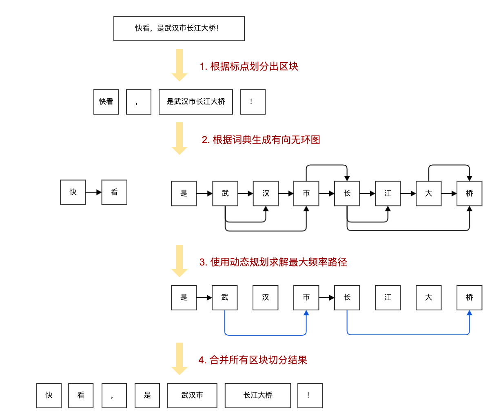

# Simple Jieba

✂️ 用 100 行实现简单版本的 [jieba](https://github.com/fxsjy/jieba) 分词。

> 真就 100 行，不信你去数一下 [./simjb/model.py](./simjb/model.py)。

## 性能对比

由于该简单版本代码只实现了 jieba 分词的核心功能，可以预期的是：**分词正确率下降，分词速度上升。**

我使用了 [bakeoff2005](http://sighan.cs.uchicago.edu/bakeoff2005/) 的数据集中的 `Peking University` 训练集和 `Microsoft Research` 训练集进行性能对比，得到的结果如下：

| Peking University(pku) | 正确率（正确词数/所有词数） | 速度（所有词数/花费时间） |
| :---------------: | :-------------------------: | :-----------------------: |
|       jieba       | **78.90%** (890761/1129003) |   119k (1129003/9.45s)    |
|       simjb       |   78.06% (881348/1129003)   | **159k** (1129003/7.10s)  |


| Microsoft Research(msr) | 正确率（正确词数/所有词数）  | 速度（所有词数/花费时间） |
| :----------------: | :--------------------------: | :-----------------------: |
|       jieba        |   76.87% (1822646/2370974)   |   133k (2370974/17.77s)   |
|       simjb        | **81.37%** (1929210/2370974) | **174k** (2370974/13.63s) |

Peking University 的结果是非常符合预期的，正确率虽有下降，但不到 1 个百分点。在 Microsoft Research 的结果中，正确率反而有些诡异的升高了将近 5 个百分点。其次，在分词速度上两者均有 **30%** 左右的提升！

我最初从 jieba 的源码中整理出这部分的核心代码，仅仅是希望后人想要学习时，有一份更简明易懂的学习资料。从上文的结果来看，这个简单版本似乎是可用的。（大家可以做更多的测试来打脸，哈哈哈）

测试方法见[这里](./test/README.md)。

## 指南



### 1 根据标点划分区块

```python
import re

class Tokenizer(object):
    def __init__(self):
        self.re_cn = re.compile("([\u4E00-\u9FD5a-zA-Z0-9+#&._%-]+)", re.U)

    def cut(self, sentence):
        block_list = self.re_cn.split(sentence)
        cut_result_list = []
        for block in block_list:
            # 跳过空的 block
            if not block:
                continue
            if self.re_cn.match(block):
                cut_result_list.extend(self.cut_util(block))
            else:
                cut_result_list.append(block)
        return cut_result_list
```

首先将输入的句子进行正则匹配切分，实际上是标点的前后切开。

```
快看，是武汉市长江大桥！
["快看", "，", "是武汉市长江大桥", "！"]
```

### 2 根据词典生成有向无环图

```python
def _get_freq_dict(self):
    stream = resource_stream(*self.dict_path)
    freq_dict = {}
    freq_total = 0
    for line in stream.readlines():
        word, freq = line.decode("utf-8").split(" ")[:2]
        freq = int(freq)
        freq_dict[word] = freq
        freq_total += freq
        for word_index in range(len(word)):
            word_frag = word[:word_index + 1]
            if word_frag not in freq_dict:
                freq_dict[word_frag] = 0
    return freq_dict, freq_total
```

首先我们需要准备一个带有词频的词典，比如：

```
AT&T 3 nz
B超 3 n
c# 3 nz
C# 3 nz
c++ 3 nz
...
```

接下来将对词典进行预处理，得到一个新的 dict。

```
{
    "AT&T": 3,
    "A": 0,
    "AT": 0,
    "AT&": 0,
    "B超": 3,
    "B": 0,
    ...
}
```

不知道你有没有注意到，除了直接添加词频构成 dict，这里还对每一个词进行前缀切分。

这些前缀对应的词频规则是：如果它在原来的词典中，那么就获取这个词的词频；如果不在，就置为 0。

（TODO: 前缀词频的作用）

```python
def _get_dag(self, sentence):
    dag = {}
    sen_len = len(sentence)
    for i in range(sen_len):
        temp_list = []
        j = i
        frag = sentence[i]
        while j < sen_len and frag in self.freq_dict:
            if self.freq_dict[frag]:
                temp_list.append(j)
            j += 1
            frag = sentence[i:j + 1]
        if not temp_list:
            temp_list.append(i)
        dag[i] = temp_list
    return dag
```

从头遍历所有的长度的词，如果它在词频字典中，就把的需要记录下来，构成有向无环图（DAG）。

```
# 快看
{0: [0], 1: [1]}
# 是武汉市长江大桥
{0: [0], 1: [1, 2, 3], 2: [2], 3: [3, 4], 4: [4, 5, 7], 5: [5], 6: [6, 7], 7: [7]}
```

### 3 使用动态规划求解最大频率路径

```python
def _calc_dag_with_dp(self, sentence):
    dag = self._get_dag(sentence)
    sen_len = len(sentence)
    route = {sen_len: (0, 0)}
    # 取 log 防止数值下溢
    log_total = log(self.freq_total)
    for sen_index in reversed(range(sen_len)):
        freq_list = []
        for word_index in dag[sen_index]:
            word_freq = self.freq_dict.get(sentence[sen_index:word_index + 1])
            # 解决 log(0) 无定义问题, 则取 log(1)=0
            freq_index = (log(word_freq or 1) - log_total + route[word_index + 1][0], word_index)
            freq_list.append(freq_index)
        route[sen_index] = max(freq_list)
    return route
```

使用动态规划反向递推出最优路径。（TODO: 优化解释）

### 4. 合并所有区块切分结果

```python
def cut_util(self, sentence):
    word_index = 0
    word_buf = ""
    result = []
    route = self._calc_dag_with_dp(sentence)
    while word_index < len(sentence):
        word_index_end = route[word_index][1] + 1
        word = sentence[word_index:word_index_end]
        # 匹配出英文
        if self.re_eng.match(word) and len(word) == 1:
            word_buf += word
            word_index = word_index_end
        else:
            if word_buf:
                result.append(word_buf)
                word_buf = ""
            else:
                result.append(word)
                word_index = word_index_end
    # 纯英文
    if word_buf:
        result.append(word_buf)
    return result
```

对于一连串的英文字母会作为一个整的单词处理，不会被切分开。

最后把所有结果汇总，分词完成！

## 许可

[](./LICENSE)

## 参考

- [中文分词相关资料](https://github.com/HaveTwoBrush/nlp-roadmap#1-%E5%88%86%E8%AF%8D-word-segmentation)
- [如何从模板创建仓库？](https://help.github.com/cn/articles/creating-a-repository-from-a-template)
- [如何发布自己的包到 pypi ？](https://www.v2ai.cn/python/2018/07/30/PY-1.html)
